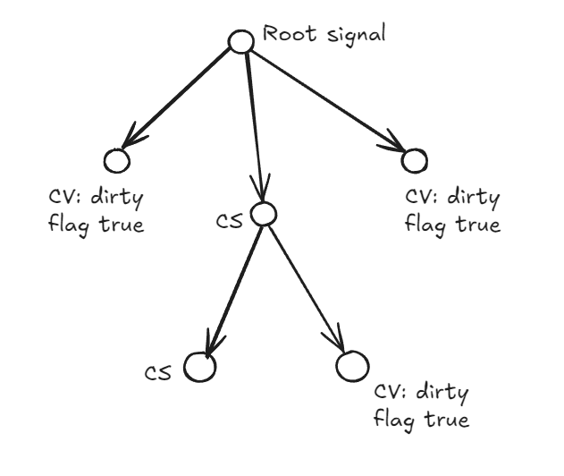

## GoSignals

Signals are a way to notify all listeners to a specific signal by broadcasting the updated value. In short there will be a writer that uses the .Set method, and a number of listeners that provide a callback and wait to be called when the data changes.
This was a very interesting project, not only about all kinds of topics that came up but also because I took inspiration from a Javascript Proposal which is currently in Stage 1 that wants to bring to js a standarized impl of Signals (github: [JS Proposal](https://github.com/tc39/proposal-signals)). Moreover in my opinion Golang it's a bit boring as a language, the plain error handling, everything is boring and sequential. I think it's a good thing, everything needs to be handled in a linear order being too creative, it works.
Having said that I made the language a bit more crazy by creating Signals which relies a lot on FP since listeners will be notified via callback they provide and everything work magically.
There are 3 main types in this lib:
- Signal
- ComputedSignal
- ComputedValue

#### They serve different purpose:
- Signals: They have a state that can be changed via .Set and can be read with .Get, moreover you can listen to data changes in async or sync mode.
- ComputedSignal: Similar to Signals but without the possibility to .Set the value, this because while creating this object a map func must be provided and when the internal flag is dirty, the value is recalculated based on that map function. Also this type accept listeners to check for data updates.
- ComputedValue: We talked about signals up until now but.. this is not a signal! Similarly to ComputedSignal this does not hold a value but a map func and during the .Get the value is recalculated and returned to the client. Since this is not a signal there are no listeners, when this computed value change you cannot listen for changes, but the value will be returned with .Get lazily.

Mind that the map functions are not recalculated everytime, or at least not always.

#### How do we know if ComputedSignal/Value needs to be recalculated?
These values are recalculate only when needed, since these two types works with two different modes we expect different results:
- ComputedSignal: the value is always recalculated everytime that another signal that this depends on changes, so everytime something changes this needs to recalculate the value because there are listeners that wait for a notification, it's unavoidable.. BUT: it's calculated only once, so future .Get will return the same cached values.
- ComputedValue: since these are not signals and don't need to satisfy any clients that needs a callback update, these are lazy loaded data, the internal flag is marker as dirty when some signals this depends on changes, It will not recalculate the value until someone calls .Get.

#### How does it work under the hood for tracking "dirty flags"?
Lets start by saying there kinda is a hierarchy Signal > Computed Signal > Computed Value.

This because a Signal has a state that can be set and can be a dependency for Computed Signals and Computed Values. 
At the same time Computed Signal can be a dependency for Computed Value but the opposive way is not true.

So we have a flow that goes from Signal to ComputedValue creating a N tree structure. This goes for each signal, each signal has it's own dependencies and it's own structure.

Everytime the signal data is .Set it go through all dependencies and:
- ask ComputedValues to set their dirty flag as true OR ask ComputedSignals to update their internal values since the parent changed and recursively repeat for their dependencies.
- Trigger the listeners async and sync altogether
- When finished, the signal itself updated everyone and all the tree has been updated with dirty flags and new calculated values we ask recursively to ComputedSignals to notify their listeners aswell.

So at the end of this process Signals and ComputedSignals will have everyone updated, meanwhile ComputedValues will have their flag dirty as true and waiting for someone to .Get to recalculated the new value.

This project is aiming of being used aync or sync without major problems, the concurrency has been dealt with mutex and rwmutex.

#### Limitations
When declaring a ComputedSig/Val we must state which other signals/computed signals we depends on, which is fine since also React JS does that with useEffect, but It would have been way nicer if the Golang could detected which signal was used inside the map func and automatically fill it for us. Having said that sometime using it manually it's a must, for example if we want to do something when a signal value change without actually using that signal, or we want to use that signal value but without depending on it but another signal. So I think doing it manually is more then fine since we have more control.

Care about deadlocks! You can't se the value of the signals tree we were called from because 1) it's under a mutex so the main signal is waiting for everyone to finish but a dependency signal is asking to .Set a value but it's stuck since the mutex is locked and will not be freed. 2) Even without this locking mechaism most likely we will get a stackoverflow due to the recursively data change from child to parent and so one since it will trigger the procedure to set dirty flags, recalc value and trigger listeners.

Those on top were not much of limitations but generally best pratices on coding, the main limitations for this is:
- For Signals/Computed Signals only comparable type are allowed which sucks a bit, otherwise we could not check if a value .Set or recalculated value is equal to the previous one. Unfortunately this limit a bit what we can do, for example no custom structs and no slices, map and so on. [I didn't set this costraint on ComputedValues since they cant be used as dependencies]

I think to bypass this problem we could create custom signals type? It would required a lot of code tho..